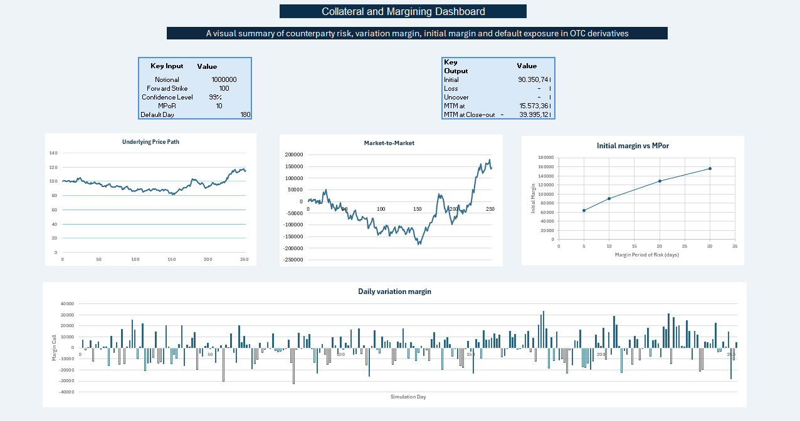

# Collateral and Margining Simulation

This project is an educational Excel and Python simulation designed to understand how collateral, variation margin, initial margin and counterparty default risk interact in OTC derivatives.

I built this project because I wanted to move beyond the theory and create a simple model that makes the mechanics of margining visible. The objective was not to build a production-grade margin engine, but to understand the intuition behind the process and explain it in a clear and accessible way.

---

## Why I Built This

Collateral is often presented as a mechanism that reduces counterparty risk. That is true, but the story is more nuanced.

Variation margin helps reduce current exposure by adjusting collateral as the value of the derivative changes. Initial margin acts as an additional buffer in case the counterparty defaults and the position cannot be closed immediately.

However, collateral does not eliminate risk completely. Under stressed market conditions, losses during the Margin Period of Risk may exceed the available initial margin. At the same time, margin calls can create liquidity pressure because market participants may need to post cash or eligible collateral quickly.

The main question I wanted to explore was:

**Does collateral fully protect against counterparty risk, or does it also transform part of that risk into liquidity pressure?**

---

## What the Model Does

The project is divided into two parts.

### 1. Excel Dashboard

The Excel model focuses on one simulated market scenario. It shows the mechanics step by step:

- simulate the underlying asset price
- calculate the mark-to-market of a simplified long forward contract
- compute daily variation margin
- estimate initial margin
- simulate a counterparty default
- calculate the loss during the Margin Period of Risk
- compare that loss with the available initial margin
- summarise the results in a dashboard

The Excel version is useful because it makes the logic visual and easy to follow.

### 2. Python Monte Carlo Extension

The Python notebook extends the Excel model by running thousands of simulated market scenarios.

Instead of asking what happens in one scenario, Python allows the model to ask:

**Across many possible market paths, how often is the initial margin not enough to cover losses during the Margin Period of Risk?**

This turns the project from a single-scenario explanation into a basic risk simulation framework.

---

## Excel Dashboard Preview

---

## Methodology

The underlying asset price is simulated using Geometric Brownian Motion. The model then calculates the value of a simplified long forward contract.

The simplified mark-to-market formula is:

**MTM = ((Underlying Price - Forward Strike) / Forward Strike) × Notional**

Variation margin is calculated as the daily change in mark-to-market:

**VM = MTM_today - MTM_yesterday**

Initial margin is estimated using a simplified parametric VaR-style approach:

**IM = z-score × Daily MTM Volatility × sqrt(MPoR)**

The default scenario compares the mark-to-market at the default day with the mark-to-market at the close-out day:

**Loss during MPoR = max(MTM at Close-out - MTM at Default, 0)**

The uncovered loss is then calculated as:

**Uncovered Loss = max(Loss during MPoR - Initial Margin, 0)**

---

## Python Monte Carlo Extension

The Python extension adds a Monte Carlo simulation layer to the Excel model.

In Excel, the dashboard explains one simulated scenario. In Python, the model runs many simulated paths and estimates the probability that losses during the Margin Period of Risk exceed the available initial margin.

This is the main value added by the Python version: it transforms the model from a single-scenario explanation into a distribution-based risk analysis.

este gráfico: Multiple Simulated Underlying Price Paths

este gráfico: Distribution of Losses During MPoR

este gráfico: Distribution of Positive Uncovered Losses

este gráfico: Initial Margin vs Loss During MPoR

este gráfico: Average Initial Margin by MPoR and Confidence Level

este gráfico: Probability of Uncovered Loss by MPoR and Confidence Level

Main Results

The Monte Carlo simulation shows that initial margin significantly reduces residual counterparty risk.

In the base case, using a 99% confidence level, the probability of uncovered loss is low, close to 1%. This is consistent with the purpose of a 99% initial margin buffer: it is designed to cover most adverse scenarios, but not every possible outcome.
The sensitivity analysis shows the main trade-off in margining. Higher confidence levels and longer Margin Periods of Risk increase the required initial margin. This reduces the probability of uncovered loss, but also increases the amount of collateral that must be posted.

---

Key Insight

The main insight from the project is that collateral reduces counterparty credit risk, but it does not eliminate risk completely.

Variation margin reduces current exposure by updating collateral daily. Initial margin provides a buffer against potential losses after default and before the position can be closed or replaced.

However, more conservative margin assumptions require more collateral. This can reduce counterparty risk, but it can also increase liquidity pressure. In other words, margining can transform part of the problem from credit risk into liquidity risk.

---

What I Learned

This project helped me understand the practical link between mark-to-market, variation margin, initial margin and counterparty default risk.

The most important learning point was that collateral is not just a static protection mechanism. It is a dynamic process. As markets move, collateral has to move as well. This makes the system safer from a credit risk perspective, but it can also create stress when large margin calls happen quickly.

Building the project first in Excel helped me understand the mechanics visually. Rebuilding it in Python then made it possible to move from one scenario to thousands of scenarios using Monte Carlo simulation.

Files
Excel Model

Download Excel Model

If GitHub opens the file preview page, click View raw to download the workbook.

Python Notebook

Open in Google Colab

Limitations

This is a simplified educational model. It does not include discounting, netting sets, collateral thresholds, minimum transfer amounts, funding costs, wrong-way risk, legal close-out mechanics or a full SIMM implementation.

The initial margin calculation used here is a simplified parametric VaR-style approximation, not an industry-standard SIMM model.

The objective is not to build a production-grade margin engine, but to make the mechanics of collateral, variation margin, initial margin and default exposure intuitive and transparent.

Next Steps

Possible extensions include:

adding historical market data
running stressed volatility scenarios
adding collateral thresholds and minimum transfer amounts
comparing Monte Carlo results with historical simulation
extending the model toward a simplified SIMM-style framework

---
